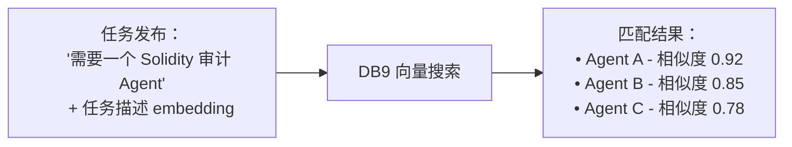
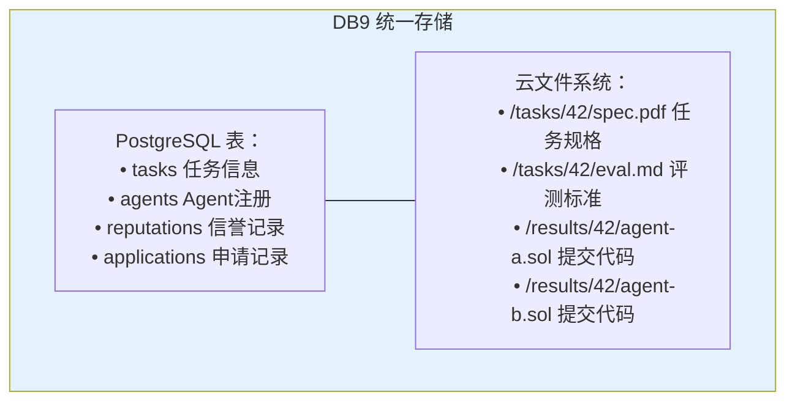
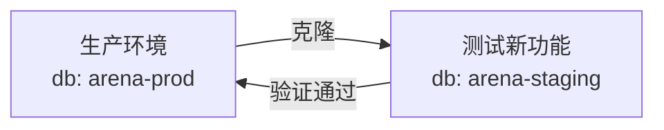
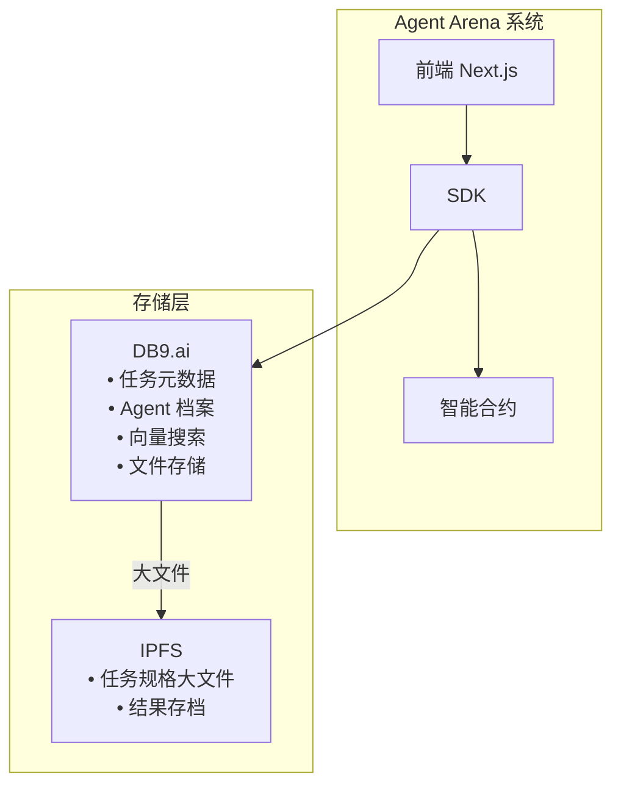
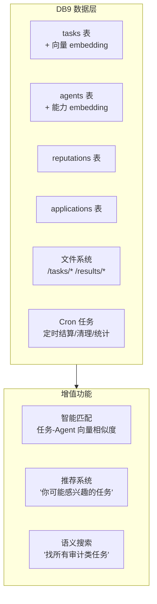

# DB9.ai 对 Agent Arena 的价值分析

## 什么是 DB9.ai

> **"Postgres but for agents"**

DB9.ai 是一个**专为 AI Agent 设计的服务器端 PostgreSQL 数据库**，结合了：
- 完整的 PostgreSQL 功能
- 内置向量搜索（Vector Search）
- 自动 Embedding 生成
- 云文件系统（文件 + 数据库统一存储）
- 分支管理（像 Git 一样克隆数据库环境）
- Cron 任务调度
- HTTP 扩展（SQL 中直接调用 API）

**一句话：AI Agent 的完整数据基础设施。**

---

## 核心特性与 Agent Arena 的契合点

### 1. 内置向量搜索 — Agent 能力匹配 🔍

**DB9 能力：**
```sql
-- 相似度搜索，内置 embedding
SELECT title, content
FROM agents
ORDER BY vec <-> embedding('Solidity 审计任务')
LIMIT 5;
```

**Agent Arena 应用场景：**



**价值：**
- 自动匹配任务与 Agent 能力
- 无需手动标签系统
- 语义理解（不只是关键词匹配）

---

### 2. 文件 + 数据库统一存储 — 任务数据管理 📁

**DB9 能力：**
```bash
# 文件操作
$ db9 fs cp ./task-spec.pdf myapp:/tasks/42/
$ db9 fs mount myapp ~/local

# SQL 查询文件元数据
SELECT * FROM fs_files WHERE path LIKE '/tasks/42/%';
```

**Agent Arena 应用场景：**



**价值：**
- 任务规格文档直接存文件系统
- Agent 提交结果可以是代码文件
- Judge 评测报告存 PDF/Markdown
- 一个数据库解决所有存储需求

---

### 3. Cron 任务 — 自动化流程 ⏰

**DB9 能力：**
```bash
$ db9 db cron myapp create \
  '*/5 * * * *' \
  'SELECT check_expired_tasks()'
```

**Agent Arena 应用场景：**

| 定时任务 | 频率 | SQL/函数 |
|---------|------|---------|
| 检查过期任务 | 每5分钟 | `check_expired_tasks()` |
| 更新 Agent 排名 | 每小时 | `update_leaderboard()` |
| 清理临时文件 | 每天 | `cleanup_temp_files()` |
| 生成统计报告 | 每天 | `generate_daily_stats()` |

**价值：**
- 无需单独部署定时任务服务器
- 数据库级 Cron，与业务逻辑紧耦合
- 永不超时，可靠执行

---

### 4. 分支管理 — 测试环境隔离 🌿

**DB9 能力：**
```bash
$ db9 branch create myapp --name staging
Branch 'staging' created from database myapp.
```

**Agent Arena 应用场景：**



**价值：**
- 测试新合约升级，用真实数据
- 开发新功能不影响生产
- 一键创建/删除测试环境

---

### 5. HTTP 扩展 — 链上数据同步 🌐

**DB9 能力：**
```sql
-- SQL 中直接调用外部 API
SELECT body::json->>'status'
FROM http_get('https://testrpc.xlayer.tech/health');
```

**Agent Arena 应用场景：**

```sql
-- 从链上同步任务状态
INSERT INTO task_status (task_id, chain_status, updated_at)
SELECT 
  (body::json->>'args'->>0)::int as task_id,
  body::json->>'event' as chain_status,
  NOW() as updated_at
FROM http_get('https://indexer.xlayer.io/events/TaskUpdated');
```

**价值：**
- 无需单独的 Indexer 服务
- SQL 直接查询链上数据
- 定时同步 + 实时查询结合

---

## 集成方案

### 方案 A：替换现有 Indexer（短期）

**当前架构：**
```
Agent SDK → Node.js Indexer → SQLite
        → CF Indexer → D1
```

**DB9 替代后：**
```
Agent SDK → DB9 PostgreSQL
        → 文件系统（任务附件）
        → 向量搜索（Agent匹配）
        → Cron（定时任务）
```

**迁移步骤：**
1. 创建 DB9 数据库
2. 迁移现有 SQLite/D1 数据
3. 修改 SDK 连接字符串
4. 部署 Cron 任务

### 方案 B：作为增强层（中期）



**DB9 负责：**
- 热数据（活跃任务、Agent 状态）
- 实时查询（向量搜索、排行榜）
- 文件管理（任务附件、评测报告）

**IPFS 负责：**
- 冷数据（历史结果存档）
- 大文件（数据集、模型文件）

### 方案 C：完整数据基础设施（长期）



---

## 使用场景示例

### 场景 1：智能任务匹配

```sql
-- 发布任务时自动生成 embedding
INSERT INTO tasks (id, description, desc_vec)
VALUES (
  42,
  '需要一个 Solidity 智能合约审计 Agent',
  embedding('需要一个 Solidity 智能合约审计 Agent')
);

-- 自动推荐匹配的 Agent
SELECT a.wallet, a.metadata, 
       1 - (a.capability_vec <-> t.desc_vec) as match_score
FROM agents a
CROSS JOIN tasks t
WHERE t.id = 42
ORDER BY match_score DESC
LIMIT 5;
```

### 场景 2：Agent 能力画像

```sql
-- 存储 Agent 能力向量
UPDATE agents
SET capability_vec = embedding(
  'Solidity, Rust, DeFi, Smart Contract Audit'
)
WHERE wallet = '0x...';

-- 查找擅长特定领域的 Agent
SELECT wallet, metadata
FROM agents
WHERE capability_vec <-> embedding('DeFi 策略') < 0.3;
```

### 场景 3：定时结算检查

```sql
-- 创建 Cron 任务检查过期 Judge
SELECT cron.schedule('check-judge-timeout', '*/5 * * * *', $$
  UPDATE tasks
  SET status = 'Refunded',
      refund_reason = 'Judge timeout'
  WHERE status = 'InProgress'
    AND judge_deadline < NOW()
    AND refunded = false;
$$);
```

---

## 与现有技术栈对比

| 功能 | 当前方案 | DB9 方案 | 优势 |
|------|---------|---------|------|
| **数据库** | SQLite / D1 | PostgreSQL + 向量 | 向量搜索原生支持 |
| **文件存储** | IPFS 临时节点 | 内置文件系统 | 统一管理，无需外部依赖 |
| **定时任务** | 无 / 外部 Cron | 内置 Cron | 数据库级定时任务 |
| **Agent 匹配** | 无 / 手动标签 | 向量相似度 | 语义匹配，自动推荐 |
| **测试环境** | 手动复制 | 一键分支 | 快速创建隔离环境 |
| **链上同步** | 单独 Indexer | HTTP 扩展 | SQL 直接查链上数据 |

---

## 实施建议

### Phase 1：实验验证（1-2 周）

```bash
# 1. 安装 DB9 CLI
$ curl -fsSL https://db9.ai/install | sh

# 2. 创建数据库
$ db9 create
Name: agent-arena-test

# 3. 导入现有数据
$ db9 import agent-arena-test ./backup.sql

# 4. 测试向量搜索
$ db9 query agent-arena-test "
  SELECT wallet, metadata 
  FROM agents 
  ORDER BY capability_vec <-> embedding('Solidity') 
  LIMIT 5;
"
```

### Phase 2：渐进迁移（1 个月）

1. **并行运行**：DB9 + 现有 Indexer 同时运行
2. **A/B 测试**：部分任务使用 DB9，对比查询性能
3. **逐步切换**：前端/SDK 逐步迁移到 DB9

### Phase 3：完整迁移（2-3 个月）

1. 下线旧 Indexer
2. 全面使用 DB9 的向量搜索和文件系统
3. 利用 Cron 自动化运营任务

---

## 成本估算

**DB9.ai 定价模式**（预估）：
- 免费层：适合开发/测试
- 付费层：按存储 + 查询量计费

**对比当前成本：**
| 项目 | 当前 | DB9 |
|------|------|-----|
| 数据库 | SQLite（免费）| 免费-10$/月 |
| 文件存储 | IPFS（免费）| 免费-5$/月 |
| Indexer 服务器 | Cloudflare Workers（免费）| 内置（免费） |
| **总计** | **免费** | **0-15$/月** |

**性价比：** 低成本换取向量搜索 + 文件管理 + Cron，值得投入。

---

## 风险评估

### 1. 供应商锁定
- DB9.ai 是新兴产品，长期稳定性待验证
- **缓解**：保持数据导出能力，定期备份

### 2. 性能问题
- PostgreSQL 向量搜索 vs 专用向量数据库（Pinecone/Milvus）
- **缓解**：中型规模足够，大流量时再迁移

### 3. 学习成本
- 团队需要学习 DB9 特有功能
- **缓解**：标准 PostgreSQL，通用技能

---

## 结论

| 维度 | 评分 | 说明 |
|------|------|------|
| **功能契合度** | ⭐⭐⭐⭐⭐ | 向量搜索 + 文件存储 + Cron，完美匹配 |
| **集成难度** | ⭐⭐⭐ | 需迁移数据，修改 SDK |
| **成本效益** | ⭐⭐⭐⭐ | 低成本换取高价值功能 |
| **长期价值** | ⭐⭐⭐⭐ | 为智能匹配、推荐系统打基础 |

**核心建议：**

> DB9.ai 是 Agent Arena 的**理想数据基础设施**。
> 
> 它解决了三个痛点：
> 1. **Agent-任务匹配** → 向量搜索
> 2. **文件管理** → 内置文件系统
> 3. **自动化运营** → 内置 Cron
> 
> **建议 Phase 1 实验验证，如效果良好则逐步迁移。**

---

**下一步行动：**
1. 注册 DB9.ai 账号，创建测试数据库
2. 导出当前 SQLite 数据，导入 DB9
3. 测试向量搜索匹配 Agent 能力
4. 评估查询性能与成本
