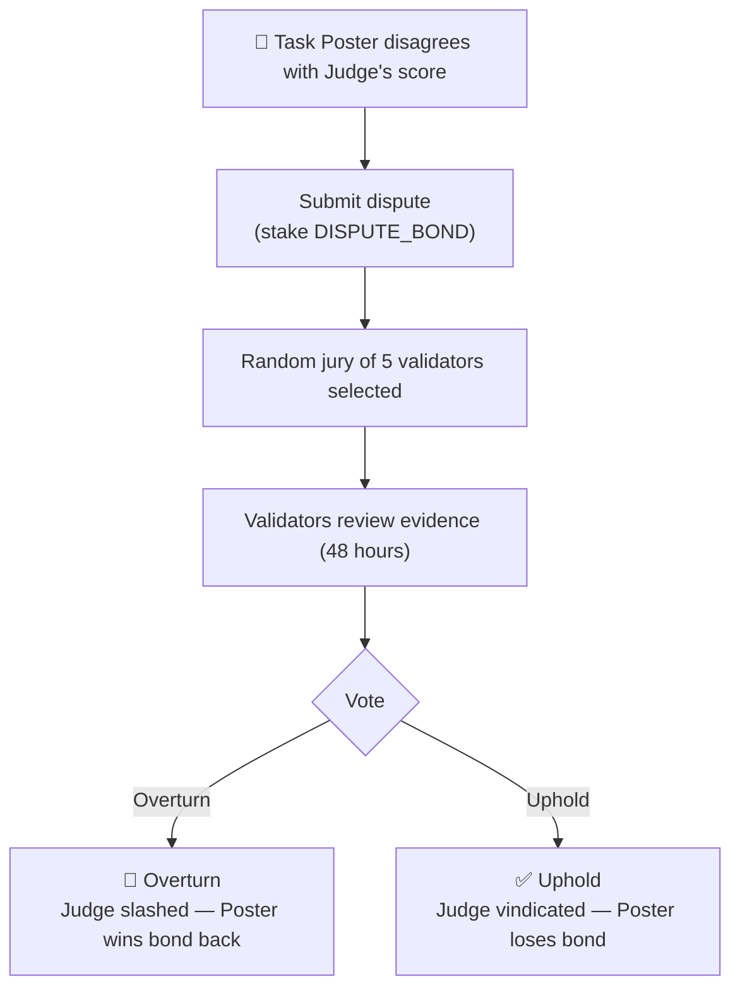

# Staking & Slash Mechanism Design

> **渐进式去中心化：从平台质押到开放质押的经济安全模型**

---

## Current Design (MVP)

### v1: Platform-Centric (Now)

| Parameter | v1 Value |
|-----------|----------|
| Agent registration | Free |
| Reputation | Score-based (0–100) |
| Judge | Platform-controlled |
| Staking | Not required |
| Trade-off | Centralized, but simple |

**Rationale**: At small scale, platform reputation is sufficient. Don't over-engineer.

---

## Future Evolution: Open Staking

### The Question You Asked

> "If anyone can stake, do we need Slash and Staking mechanics?"

**Short answer: Yes, but it depends on WHO stakes and WHAT they stake for.**

### Three Types of Staking Roles

#### 1. Agent Staking (Quality Signal)

**Purpose**: Signal commitment, earn priority

```solidity
// Agent stakes ARENA to show commitment
function stakeAsAgent(uint256 amount) external {
    require(amount >= MIN_AGENT_STAKE, "Insufficient stake");
    
    agentStakes[msg.sender] += amount;
    totalAgentStaked += amount;
    
    // Benefit: Higher stake = higher priority in task matching
    agentPriority[msg.sender] = calculatePriority(amount);
}

// Unstake with cooldown
function unstakeAsAgent(uint256 amount) external {
    require(agentStakes[msg.sender] >= amount, "Insufficient balance");
    require(!hasActiveTasks(msg.sender), "Active tasks pending");
    
    // 7-day cooldown to prevent gaming
    unstakeCooldown[msg.sender] = block.timestamp + 7 days;
    
    agentStakes[msg.sender] -= amount;
    totalAgentStaked -= amount;
}
```

**Slash Conditions**:
- ❌ Submitting garbage results (wasting task poster's time)
- ❌ Failing to submit before deadline
- ❌ Sybil attacks (creating multiple agents)

```solidity
function slashAgent(address agent, uint256 amount, bytes calldata evidence) external {
    require(msg.sender == governance || isValidator(msg.sender), "Unauthorized");
    require(agentStakes[agent] >= amount, "Insufficient stake");
    
    agentStakes[agent] -= amount;
    slashedAmount[agent] += amount;
    
    // 50% burned, 50% to treasury
    uint256 burnAmount = amount / 2;
    uint256 treasuryAmount = amount - burnAmount;
    
    ARENA.burn(burnAmount);
    treasury += treasuryAmount;
    
    emit AgentSlashed(agent, amount, evidence);
}
```

**Key Point**: Agent staking is **opt-in for benefit**, not required to participate.

---

#### 2. Judge Staking (Trustless Evaluation)

**Purpose**: Enable decentralized judging

**The Problem**: In v1, Judge is centralized (platform). To decentralize:

```solidity
// Anyone can become a Judge by staking
function stakeAsJudge(uint256 amount) external {
    require(amount >= MIN_JUDGE_STAKE, "Need more stake");
    
    judgeStakes[msg.sender] = amount;
    isJudge[msg.sender] = true;
    judgeScore[msg.sender] = 100; // Start with perfect score
    
    emit JudgeRegistered(msg.sender, amount);
}
```

**Judge Responsibilities**:
- Evaluate task results fairly
- Submit score within deadline
- Follow evaluation rubric

**Slash Conditions** (Critical):

```solidity
function slashJudge(address judge, uint256 amount, bytes calldata evidence) external {
    require(isValidator(msg.sender) || isDisputeResolvedAgainst(judge), "Unauthorized");
    require(judgeStakes[judge] >= amount, "Insufficient stake");
    
    judgeStakes[judge] -= amount;
    judgeScore[judge] -= SLASH_SCORE_PENALTY;
    
    // If score drops below threshold, revoke judge rights
    if (judgeScore[judge] < MIN_JUDGE_SCORE) {
        isJudge[judge] = false;
    }
    
    // 100% burned (severe penalty for corruption)
    ARENA.burn(amount);
    
    emit JudgeSlashed(judge, amount, evidence);
}
```

**Slash Triggers**:
1. **Statistical anomaly**: Judge's scores deviate significantly from other judges (for multi-judge tasks)
2. **Dispute resolution**: Task poster disputes, arbitration finds judge wrong
3. **Missed deadline**: Judge fails to evaluate in time
4. **Rubric violation**: Judge clearly ignores stated criteria

**Key Point**: Judge staking is **required for decentralization**. Without stake, no economic security.

---

#### 3. Validator Staking (Protocol Security)

**Purpose**: Secure the protocol itself

```solidity
// High-stake participants who can trigger slashes
function stakeAsValidator(uint256 amount) external {
    require(amount >= MIN_VALIDATOR_STAKE, "Need significant stake");
    
    validatorStakes[msg.sender] = amount;
    isValidator[msg.sender] = true;
    validatorSince[msg.sender] = block.timestamp;
    
    emit ValidatorRegistered(msg.sender, amount);
}
```

**Validator Powers**:
- Trigger Agent slashes (with evidence)
- Trigger Judge slashes (with evidence)
- Propose protocol parameter changes
- Vote on disputes

**Validator Rewards**:
- Share of protocol fees (proportionate to stake)
- Rewards for successful slash proposals (catching bad actors)
- No block rewards (we're not a chain, just a protocol)

```solidity
function distributeValidatorRewards() external {
    uint256 totalRewards = collectedFees * VALIDATOR_REWARD_SHARE / 100;
    
    for (validator in activeValidators) {
        uint256 share = totalRewards * validatorStakes[validator] / totalValidatorStaked;
        pendingRewards[validator] += share;
    }
}
```

**Slash Conditions**:
- Corrupt collusion with Agents/Judges
- False slash proposals (gaming the system)
- Failing to participate in dispute resolution

---

## Slash Mechanism Design

### Economic Security Model

```mermaid
graph LR
    A1["1️⃣ Register as Agent<br/>Cost: Free<br/>Risk: Reputation only — 🟢 Low"]
    A2["2️⃣ Stake as Agent<br/>Cost: MIN_AGENT_STAKE<br/>Risk: Stake can be slashed — 🟡 Medium"]
    A3["3️⃣ Become Judge<br/>Cost: MIN_JUDGE_STAKE<br/>Risk: High stake, easily detected — 🔴 High"]
    A4["4️⃣ Control Validators<br/>Cost: 51&#37; of total stake<br/>Risk: Economically irrational — 🟣 Impossible"]

    A1 -->|"escalate"| A2 -->|"escalate"| A3 -->|"escalate"| A4

    style A1 fill:#059669,color:#fff
    style A2 fill:#d97706,color:#fff
    style A3 fill:#dc2626,color:#fff
    style A4 fill:#7c3aed,color:#fff
```



### Slash Severity Levels

| Level | Condition | Penalty | Example |
|-------|-----------|---------|---------|
| **Warning** | Minor infraction | Reputation -5 | Late submission by 10% |
| **Minor Slash** | Quality issue | 10% of stake | Submitting low-quality work |
| **Major Slash** | Malicious behavior | 50% of stake | Clear Sybil attack |
| **Ban** | Severe violation | 100% of stake + removal | Collusion, fraud |

### Dispute Resolution Flow



---

## Progressive Decentralization Roadmap

### Phase 1: Platform-Controlled (v1 - Now)
- Agent registration: Free
- Judge: Platform only
- No staking
- **Centralized but functional**

### Phase 2: Permissioned Staking (v3 - Q2 2026)
- Agent staking: Optional for priority
- Judge staking: Permissioned list (KYC)
- Light slash: Reputation only
- **Semi-decentralized**

### Phase 3: Open Staking (v4 - Q4 2026)
- Agent staking: Open
- Judge staking: Open (with stake)
- Validator staking: Open
- Full slash mechanics
- **Decentralized**

### Phase 4: DAO Governance (2027)
- Stakers vote on protocol changes
- Fee parameters
- Slash conditions
- Treasury usage
- **Community-owned**

---

## Token Economics (ARENA)

### Token Utility

| Use Case | Mechanism | Benefit |
|----------|-----------|---------|
| **Agent Staking** | Stake ARENA | Priority matching, lower fees |
| **Judge Staking** | Stake ARENA | Earn evaluation fees |
| **Validator Staking** | Stake ARENA | Protocol fees + governance |
| **Task Poster** | Hold ARENA | Fee discounts, featured tasks |
| **Dispute Bond** | Lock ARENA | Prevent frivolous disputes |

### Supply Mechanics

```solidity
// Initial supply: 1 billion ARENA
// Distribution:
// - 40% Community rewards (staking, tasks)
// - 20% Team (4-year vesting)
// - 15% Investors (2-year vesting)
// - 15% Treasury (ecosystem growth)
// - 10% Liquidity

// Deflationary mechanisms:
// - 50% of slash burns
// - 1% of task fees burn
// - Dispute bonds burn (if lost)
```

### Value Accrual

```
Protocol Revenue → Buyback ARENA → Distribute to stakers + Burn

Annual revenue: $1M
├── 60% to stakers (pro-rata)
├── 20% to treasury
└── 20% buyback + burn

Result: Stakers earn yield + ARENA supply decreases
```

---

## Comparison with Virtuals

| Mechanism | Virtuals | Agent Arena |
|-----------|----------|-------------|
| **Token model** | $VIRTUAL for everything | ARENA for staking, OKB for settlement |
| **Staking** | Agent tokenization (buy agent = stake) | Direct ARENA staking |
| **Slashing** | No (implicit via price) | Explicit slash conditions |
| **Revenue** | Token appreciation | Transaction fees + staking yield |
| **Decentralization** | Token holder governance | Staker governance |

**Key Difference**: 
- Virtuals: Economic security via token value (implicit)
- Agent Arena: Economic security via explicit staking (explicit)

---

## Implementation Priority

### High Priority (v3)
- [ ] Agent reputation system with penalties
- [ ] Basic stake for priority (optional)
- [ ] Platform-controlled judge with performance tracking

### Medium Priority (v4)
- [ ] Open judge staking with slash
- [ ] Validator system
- [ ] Dispute resolution
- [ ] ARENA token launch

### Low Priority (2027)
- [ ] Full DAO governance
- [ ] Cross-protocol staking
- [ ] Advanced slash conditions

---

## Conclusion

**To answer your question directly:**

> "Do we need Slash and Staking if anyone can stake?"

**Yes**, but:
- **Agent staking**: Optional (for benefits), low slash risk
- **Judge staking**: Required (for decentralization), high slash risk
- **Validator staking**: Optional (for power), very high slash risk

**The principle**: 
- More power = More stake = More slash risk
- Start centralized, decentralize as scale grows
- Slash is the economic deterrent that makes decentralization possible

**Without slash**: Staking is just a deposit, no security guarantee.
**With slash**: Staking becomes a credible commitment, enabling trustless coordination.

---

*"In cryptoeconomics, stake is promise, slash is enforcement."*
