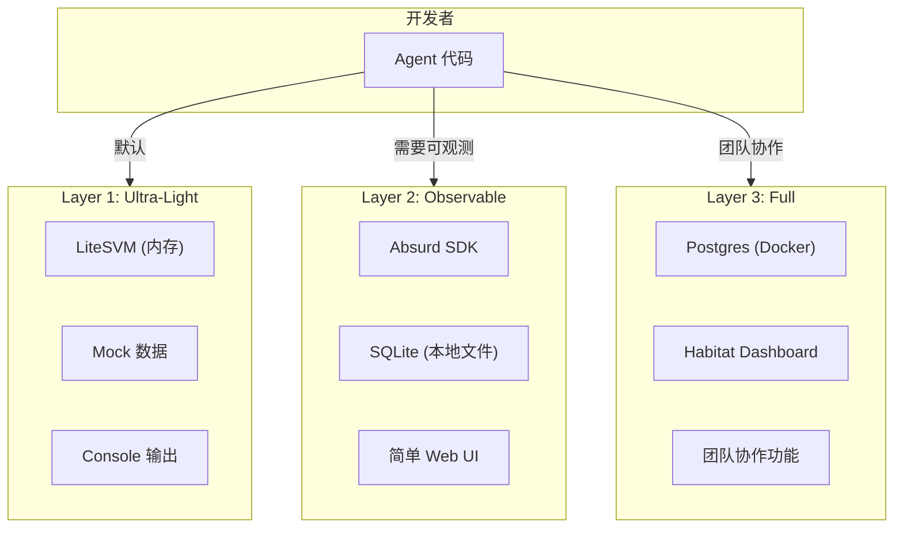

# Absurd 可观测性 vs Sandbox Tighter Feedback Loop 分析

> **问题**: Absurd 的可观测数据库是否可以用于 Sandbox / Tighter Feedback Loop?  
> **分析日期**: 2026-03-28  
> **参考**: https://earendil-works.github.io/absurd/

---

## 1. Absurd 是什么

### 1.1 核心定位

```
Absurd = Postgres-native Durable Workflow System
         ↓
将 durable execution 复杂性移到数据库层 (stored procedures)
         ↓
轻量级 SDK，语言无关，只需 Postgres + absurd.sql
```

### 1.2 关键组件

| 组件 | 功能 | 与 Sandbox 关系 |
|------|------|-----------------|
| **absurd.sql** | 核心 schema (stored procedures) | 可用于持久化执行状态 |
| **TypeScript/Python SDK** | 任务注册和执行 | Agent 执行框架 |
| **absurdctl** | CLI 管理工具 | 调试/检查工具 |
| **Habitat** | Web Dashboard 监控 | **可观测性核心** |

### 1.3 Habitat 可观测功能

从文档可知 Habitat 提供：
- **Tasks** 监控
- **Runs** 执行记录
- **Events** 事件追踪

```
┌─────────────────────────────────────────────┐
│              Habitat Dashboard              │
├─────────────────────────────────────────────┤
│  Tasks: order-fulfillment (running)         │
│  ├── Step 1: process-payment ✅ (completed) │
│  ├── Step 2: awaitEvent ⏳ (waiting)        │
│  └── Step 3: send-notification ⏸️ (pending) │
├─────────────────────────────────────────────┤
│  Events:                                    │
│  - shipment.packed:12345 emitted at 10:05   │
│  - payment.failed:12345 emitted at 10:02    │
└─────────────────────────────────────────────┘
```

---

## 2. 能否用于 Sandbox?

### 2.1 直接回答

> **可以，但有不同的侧重点**

| 需求 | Sandbox 目标 | Absurd 提供 | 匹配度 |
|------|-------------|-------------|--------|
| **速度** | 秒级反馈 | Postgres 持久化 (ms级) | ⚠️ 略重 |
| **可观测** | 执行过程可见 | ✅ Habitat Dashboard | ✅ 很好 |
| **本地开发** | 无需外部依赖 | 需要 Postgres | ⚠️ 需要 Docker |
| **执行恢复** | 快速重启 | ✅ Step checkpoint | ✅ 很好 |
| **事件追踪** | 调试 Agent 行为 | ✅ Event system | ✅ 很好 |

### 2.2 两种使用模式

#### 模式 A: Lite Sandbox (无 Absurd)

```
┌─────────────────────────────────────────────┐
│         Sandbox without Absurd              │
├─────────────────────────────────────────────┤
│  Local Chain (LiteSVM)                      │
│       ↓                                     │
│  Agent Execution (内存中)                    │
│       ↓                                     │
│  Console Logs / 简单 Dashboard              │
└─────────────────────────────────────────────┘

特点:
- 最快启动 (<1s)
- 零外部依赖
- 重启后状态丢失
- 适合: 快速迭代、单元测试
```

#### 模式 B: Durable Sandbox (with Absurd)

```
┌─────────────────────────────────────────────┐
│         Sandbox with Absurd                 │
├─────────────────────────────────────────────┤
│  Local Chain (LiteSVM)                      │
│       ↓                                     │
│  Absurd SDK                                 │
│       ↓                                     │
│  SQLite / Local Postgres (Docker)           │
│       ↓                                     │
│  Habitat Dashboard                          │
└─────────────────────────────────────────────┘

特点:
- 稍慢启动 (2-3s Docker up)
- 需要 Postgres
- 执行可恢复 (checkpoint)
- 丰富的可观测性
- 适合: 复杂 Agent、长时间任务、团队协作
```

---

## 3. 推荐架构: 分层 Sandbox

### 3.1 三层 Sandbox 设计



### 3.2 各层使用场景

| 层 | 启动时间 | 使用场景 | CLI |
|----|----------|----------|-----|
| **Layer 1** | <1s | 日常开发、快速测试 | `arena-sandbox --light` |
| **Layer 2** | 1-2s | 调试复杂逻辑、需要执行历史 | `arena-sandbox` |
| **Layer 3** | 3-5s | 团队共享、长时间任务 | `arena-sandbox --full` |

---

## 4. Absurd 的具体应用

### 4.1 Agent 执行作为 Absurd Task

```typescript
// sandbox/src/agent-runner.ts
import { Absurd } from 'absurd-sdk';
import Database from 'better-sqlite3';

const app = new Absurd({
  // 使用 SQLite 代替 Postgres 用于本地开发
  database: new Database('./sandbox.db'),
});

// 注册 Agent 执行任务
app.registerTask({ name: 'agent-execute-task' }, async (params, ctx) => {
  const { taskId, agentCode, input } = params;
  
  // Step 1: 加载 Agent
  const agent = await ctx.step('load-agent', async () => {
    return await loadAgent(agentCode);
  });
  
  // Step 2: 执行任务（可能长时间运行）
  const result = await ctx.step('execute-task', async () => {
    return await agent.execute(input);
  });
  
  // Step 3: 本地 Mock Judge 评分
  const score = await ctx.step('local-judge', async () => {
    return await mockJudge.evaluate(result);
  });
  
  // Step 4: 等待用户确认（如果有疑问）
  if (score < 50) {
    await ctx.awaitEvent(`user.review:${taskId}`);
  }
  
  return { taskId, result, score };
});

// 启动 worker
await app.startWorker();
```

### 4.2 可观测性好处

```
执行 Agent 任务时，Habitat 显示:

Task: agent-execute-task
Run ID: run_abc123
Status: running

Steps:
1. load-agent           ✅ 0.5s   "Agent loaded: code-reviewer-v2"
2. execute-task         ⏳ 45s    "Processing line 234/500..."
3. local-judge          ⏸️ pending
4. user.review          ⏸️ pending

Events:
- agent.log: "Warning: deprecated API detected"
- agent.metric: "tokens_used=1500"
```

### 4.3 热重载集成

```typescript
// Hot Reload + Absurd = 完美组合
const hotReload = new AgentHotReload(agentPath, {
  onChange: async () => {
    // 1. 取消当前 Absurd task
    await absurd.cancelCurrentRun();
    
    // 2. 但保留执行历史（checkpoint）
    const lastCheckpoint = await absurd.getLastCheckpoint();
    
    // 3. 从 checkpoint 重新启动
    await absurd.restartFromCheckpoint(lastCheckpoint);
    
    console.log('🔄 Hot reload: resumed from checkpoint');
  },
});
```

---

## 5. 与之前 V2 Tech Selection 的关系

### 5.1 之前的结论

在 `v2-tech-selection.md` 中，我们分析了：

| 方案 | 开发时间 | 特点 |
|------|----------|------|
| **自研** | 2-3 周 | 完全控制 |
| **Absurd** | 3-5 天 | Postgres-native, Habitat Dashboard |
| **Hybrid** | 1-2 周 | 短任务自研，长任务 Absurd |

**当时推荐**: Absurd for V2 production

### 5.2 现在的新发现

Absurd 的 **Habitat** 提供了 Sandbox 需要的可观测性！

这意味着：
- ✅ **V2 Execution Engine** → 使用 Absurd (已推荐)
- ✅ **Sandbox Tighter Feedback Loop** → 复用 Absurd 的基础设施

### 5.3 统一架构

```
┌─────────────────────────────────────────────────────────────┐
│                    Gradience Stack                          │
├─────────────────────────────────────────────────────────────┤
│  Sandbox (本地开发)                                          │
│  ├── Lite mode: LiteSVM + 内存执行 (最快)                     │
│  └── Full mode: LiteSVM + Absurd + SQLite (可观测)           │
├─────────────────────────────────────────────────────────────┤
│  V2 Production (生产环境)                                    │
│  └── Absurd + Postgres + Habitat (可扩展)                    │
├─────────────────────────────────────────────────────────────┤
│  共享: Absurd SDK, Task 定义, Step 逻辑                      │
└─────────────────────────────────────────────────────────────┘
```

**好处**: 开发环境和生产环境使用相同的执行框架！

---

## 6. 实施建议

### Phase 1: Lite Sandbox (本周)

```bash
# 最快的反馈循环
arena-sandbox start --agent ./my-agent --light
```

- LiteSVM 本地链
- 内存执行
- Console 输出
- <1s 启动

### Phase 2: Observable Sandbox (下周)

```bash
# 添加可观测性
arena-sandbox start --agent ./my-agent
```

- LiteSVM 本地链
- Absurd SDK + SQLite
- 简单 Web UI (类似 Habitat Lite)
- 执行历史保留

### Phase 3: Full Sandbox (可选)

```bash
# 团队共享
arena-sandbox start --agent ./my-agent --full
```

- LiteSVM 本地链
- Absurd + Postgres (Docker)
- 完整 Habitat Dashboard
- 团队协作

---

## 7. 总结

### 核心结论

> **是的，Absurd 的可观测数据库非常适合 Sandbox！**

但需要**分层设计**：

| 场景 | 推荐方案 |
|------|----------|
| **日常快速迭代** | Lite Sandbox (无 Absurd) |
| **调试复杂问题** | Observable Sandbox (Absurd + SQLite) |
| **团队协作/长时间任务** | Full Sandbox (Absurd + Postgres + Habitat) |
| **生产环境** | Absurd + Postgres (已推荐用于 V2) |

### 关键优势

1. **统一技术栈**: Sandbox 和 Production 都用 Absurd
2. **执行可恢复**: Checkpoint 机制，Agent 崩溃可恢复
3. **丰富可观测性**: Habitat Dashboard 提供任务、步骤、事件的全链路追踪
4. **渐进采用**: 从轻量级开始，按需添加可观测性

### 下一步行动

1. [ ] 评估 Absurd SQLite 模式的可行性
2. [ ] 设计 Lite → Observable → Full 的渐进路径
3. [ ] 实现 Phase 1 (Lite Sandbox) 用于本周开发
4. [ ] 同时关注 Absurd 的 Habitat 开源进展

---

*文档版本: v1.0*  
*最后更新: 2026-03-28*
