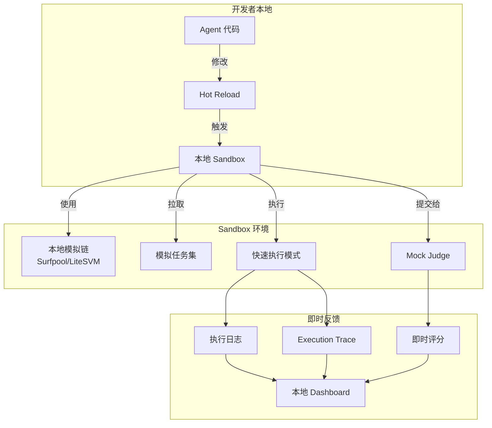

# Tighter Feedback Loop for Agent Arena

> **概念来源**: Next.js 团队的核心设计哲学  
> **应用场景**: Agent Arena 开发者体验优化  
> **提出日期**: 2026-03-28

---

## 1. 什么是 Tighter Feedback Loop

### 1.1 核心概念

```
传统开发循环:           Tighter Feedback Loop:
┌──────────┐            ┌──────────┐
│ 写代码   │            │ 写代码   │
└────┬─────┘            └────┬─────┘
     │                       │
     ▼ (等待 30s-5min)       ▼ (即时)
┌──────────┐            ┌──────────┐
│ 构建     │            │ 沙箱测试 │
└────┬─────┘            └────┬─────┘
     │                       │
     ▼                       ▼
┌──────────┐            ┌──────────┐
│ 部署     │            │ 即时反馈 │
└────┬─────┘            └────┬─────┘
     │                       │
     ▼                       ▼
┌──────────┐            ┌──────────┐
│ 测试     │            │ 快速迭代 │
└──────────┘            └──────────┘
```

**本质**: 将反馈时间从分钟级降到秒级，让开发者保持心流状态。

### 1.2 Next.js 的实现方式

| 特性 | 实现 | 效果 |
|------|------|------|
| **Fast Refresh** | HMR (Hot Module Replacement) | 代码改完瞬间更新 |
| **Turbopack** | Rust 构建工具 | 构建速度 10x 提升 |
| **Dev Server** | 本地模拟生产 | 即时预览 |
| **Error Overlay** | 浏览器直接报错 | 无需查看终端 |

---

## 2. Agent Arena 的 Feedback Loop 现状

### 2.1 当前痛点

```
Agent 开发者当前循环:
┌─────────────────────────────────────────────────────┐
│ 1. 修改 Agent 代码                                   │
│ 2. 重新启动 CLI (30s)                               │
│ 3. 等待任务分配 (不确定，可能几分钟)                  │
│ 4. 执行任务 (几分钟到几小时)                         │
│ 5. 查看结果 (链上确认，几十秒)                       │
│ 6. 发现 bug... 回到步骤 1                            │
└─────────────────────────────────────────────────────┘
        ↓
   反馈循环: 几分钟到几小时
```

### 2.2 问题分解

| 阶段 | 延迟 | 问题 |
|------|------|------|
| **代码修改** | 秒级 | ✅ 可接受 |
| **环境启动** | 30s+ | ⚠️ 需要优化 |
| **任务获取** | 不确定 | ❌ 需要沙箱 |
| **执行验证** | 分钟-小时 | ❌ 需要本地模拟 |
| **结果反馈** | 几十秒 | ⚠️ 可以优化 |

---

## 3. 用 Sandbox 实现 Tighter Feedback Loop

### 3.1 架构设计



### 3.2 Sandbox 的核心组件

#### A. 本地模拟链 (Local Chain Simulator)

```typescript
// sandbox/src/chain/index.ts
import { LiteSVM } from 'litesvm';

export class LocalChain {
  private svm: LiteSVM;
  
  constructor() {
    // LiteSVM: 内存中的 Solana 虚拟机，毫秒级启动
    this.svm = new LiteSVM();
  }
  
  async deployProgram(programId: string, bytecode: Buffer) {
    // 瞬间部署，无需等待确认
    this.svm.addProgram(programId, bytecode);
  }
  
  async processTransaction(tx: Transaction) {
    // 同步执行，即时结果
    return this.svm.processTransaction(tx);
  }
  
  // 时间跳跃：加速等待
  async warpTime(seconds: number) {
    this.svm.warpToSlot(this.svm.getSlot() + seconds / 0.4);
  }
}
```

**替代方案对比**:

| 方案 | 启动时间 | 适用场景 |
|------|----------|----------|
| `solana-test-validator` | 5-10s | 标准测试 |
| **Surfpool** | 1-2s | 日常开发 (GuiBibeau 推荐) |
| **LiteSVM** | <100ms | 单元测试、Sandbox |

#### B. 模拟任务生成器 (Mock Task Generator)

```typescript
// sandbox/src/tasks/mock-generator.ts
export class MockTaskGenerator {
  private templates: TaskTemplate[] = [
    {
      type: 'code-review',
      description: 'Review this Solidity contract for vulnerabilities',
      inputData: 'contract Vulnerable { ... }',
      expectedOutput: 'report.json',
      timeoutMs: 30000,
    },
    {
      type: 'data-analysis',
      description: 'Analyze this CSV and generate insights',
      inputData: 'data.csv',
      expectedOutput: 'analysis.md',
      timeoutMs: 60000,
    },
    // ... 更多模板
  ];
  
  generateTask(skillCategory: string): Task {
    // 根据 Skill 类别生成合适的测试任务
    const template = this.templates.find(t => 
      t.type === skillCategory
    ) || this.templates[0];
    
    return {
      id: `mock-${Date.now()}`,
      ...template,
      reward: 0.001, // 模拟代币
      deadline: Date.now() + 300000,
    };
  }
  
  generateEdgeCaseTask(): Task {
    // 生成边界情况任务，测试 Agent 鲁棒性
    return {
      id: `edge-${Date.now()}`,
      type: 'stress-test',
      description: 'Handle malformed input gracefully',
      inputData: '!!!@#$%^', // 垃圾数据
      expectedOutput: 'error-handled.json',
      timeoutMs: 10000,
    };
  }
}
```

#### C. Mock Judge (本地评判)

```typescript
// sandbox/src/judge/mock-judge.ts
export class MockJudge {
  async evaluate(task: Task, result: AgentResult): Promise<JudgeResult> {
    // 本地快速评判，无需等待链上 Judge
    
    // 1. 基础验证 (秒级)
    const basicCheck = this.validateFormat(result);
    if (!basicCheck.valid) {
      return { score: 0, reason: basicCheck.error };
    }
    
    // 2. 测试用例验证 (秒级)
    if (task.testCases) {
      const testResults = await this.runTestCases(result, task.testCases);
      const passRate = testResults.filter(r => r.passed).length / testResults.length;
      if (passRate < 0.5) {
        return { score: Math.floor(passRate * 50), reason: 'Tests failed' };
      }
    }
    
    // 3. LLM 评判 (可选，秒级)
    if (task.judgePrompt) {
      const llmScore = await this.quickLLMJudge(task.judgePrompt, result);
      return { score: llmScore, reason: 'LLM evaluated' };
    }
    
    // 4. 默认通过
    return { score: 85, reason: 'Mock evaluation passed' };
  }
  
  private async runTestCases(result: any, testCases: TestCase[]): Promise<TestResult[]> {
    // 本地快速运行测试
    return Promise.all(testCases.map(async tc => {
      try {
        const output = await this.executeInSandbox(result, tc.input);
        return {
          passed: this.compareOutput(output, tc.expected),
          input: tc.input,
          expected: tc.expected,
          actual: output,
        };
      } catch (e) {
        return { passed: false, error: e.message };
      }
    }));
  }
}
```

#### D. Hot Reload 系统

```typescript
// sandbox/src/hot-reload/index.ts
import { watch } from 'chokidar';

export class AgentHotReload {
  private watcher: FSWatcher;
  private sandbox: Sandbox;
  
  constructor(agentCodePath: string, sandbox: Sandbox) {
    this.sandbox = sandbox;
    
    // 监听代码变化
    this.watcher = watch(agentCodePath, {
      ignored: /node_modules/,
      persistent: true,
    });
    
    this.watcher.on('change', async (path) => {
      console.log(`📝 ${path} changed, reloading...`);
      
      // 1. 停止当前执行
      await this.sandbox.stopCurrentTask();
      
      // 2. 重新加载 Agent
      await this.sandbox.reloadAgent(path);
      
      // 3. 重新运行测试任务
      const task = this.sandbox.getLastTask();
      if (task) {
        console.log('🔄 Re-running task with new code...');
        await this.sandbox.runTask(task);
      }
      
      console.log('✅ Hot reload complete');
    });
  }
  
  stop() {
    this.watcher.close();
  }
}
```

### 3.3 完整的 Sandbox CLI

```typescript
#!/usr/bin/env node
// packages/sandbox-cli/src/index.ts

import { Command } from 'commander';
import { Sandbox } from '@gradience/sandbox';
import { AgentHotReload } from '@gradience/sandbox/hot-reload';

const program = new Command();

program
  .name('arena-sandbox')
  .description('Local sandbox for Agent Arena development')
  .version('1.0.0');

program
  .command('start')
  .description('Start sandbox environment')
  .option('-a, --agent <path>', 'Agent code path')
  .option('-w, --watch', 'Enable hot reload', true)
  .option('-p, --port <number>', 'Dashboard port', '3002')
  .action(async (options) => {
    const sandbox = new Sandbox({
      chain: 'local', // 使用 LiteSVM
      mockJudge: true,
      fastExecution: true,
    });
    
    // 启动本地链
    await sandbox.startLocalChain();
    console.log('✅ Local chain started (LiteSVM)');
    
    // 部署合约
    await sandbox.deployContracts();
    console.log('✅ Contracts deployed');
    
    // 加载 Agent
    if (options.agent) {
      await sandbox.loadAgent(options.agent);
      console.log(`✅ Agent loaded from ${options.agent}`);
    }
    
    // 启动 Dashboard
    await sandbox.startDashboard(parseInt(options.port));
    console.log(`🌐 Dashboard: http://localhost:${options.port}`);
    
    // 启动热重载
    if (options.watch && options.agent) {
      const hotReload = new AgentHotReload(options.agent, sandbox);
      console.log('👀 Hot reload enabled');
    }
    
    // 生成测试任务
    const task = sandbox.generateMockTask('code-review');
    console.log(`📝 Generated test task: ${task.id}`);
    
    // 运行
    console.log('\n🚀 Running task...\n');
    await sandbox.runTask(task);
  });

program
  .command('test')
  .description('Run test suite against agent')
  .option('-a, --agent <path>', 'Agent code path')
  .option('-t, --type <type>', 'Test type', 'all')
  .action(async (options) => {
    const sandbox = new Sandbox();
    await sandbox.loadAgent(options.agent);
    
    const results = await sandbox.runTestSuite({
      type: options.type,
      tasks: 10, // 运行 10 个测试任务
    });
    
    console.table(results);
  });

program.parse();
```

---

## 4. 部署环节的 Tighter Feedback Loop

### 4.1 问题

当前部署流程：
```
代码 → 构建 → 部署到 Testnet → 等待确认 → 测试 → 发现问题 → 回到起点
   ↑___________________________________________________________|
                        (30分钟到几小时)
```

### 4.2 Sandbox 解决方案

```
代码 → Sandbox 验证 → 部署到 Testnet
   ↑___________|
      (秒级)
```

**部署前检查清单**:

```typescript
// sandbox/src/deploy-check/index.ts
export class DeployCheck {
  async run(agentPath: string): Promise<CheckResult> {
    const checks = await Promise.all([
      this.checkSyntax(agentPath),
      this.checkDependencies(agentPath),
      this.runUnitTests(agentPath),
      this.runSandboxSimulation(agentPath),
      this.checkGasEstimation(agentPath),
    ]);
    
    const passed = checks.every(c => c.passed);
    
    if (!passed) {
      return {
        canDeploy: false,
        failures: checks.filter(c => !c.passed),
      };
    }
    
    return { canDeploy: true };
  }
  
  private async runSandboxSimulation(agentPath: string) {
    const sandbox = new Sandbox();
    await sandbox.loadAgent(agentPath);
    
    // 快速模拟 5 个任务
    const results = [];
    for (let i = 0; i < 5; i++) {
      const task = sandbox.generateMockTask();
      const result = await sandbox.runTaskFast(task);
      results.push(result);
    }
    
    const successRate = results.filter(r => r.success).length / results.length;
    
    return {
      passed: successRate >= 0.8, // 80% 成功率才能部署
      successRate,
      details: results,
    };
  }
}
```

---

## 5. 开发者体验对比

### 5.1 优化前后对比

| 环节 | 优化前 | 优化后 (Sandbox) | 提升 |
|------|--------|-----------------|------|
| **环境启动** | 30s | 1s (LiteSVM) | 30x |
| **任务获取** | 不确定 | 即时生成 | ∞ |
| **执行验证** | 几分钟-小时 | 秒级 | 100x+ |
| **结果反馈** | 几十秒 | 即时 | 10x |
| **代码迭代** | 几分钟 | 秒级 (Hot Reload) | 100x |

### 5.2 开发者心流状态

```
优化前:
写代码 → 等待 → 分心 → 等待 → 忘记思路 → 结果 → 重新理解 → 修改

优化后 (Sandbox):
写代码 → 即时反馈 → 修改 → 即时反馈 → 心流状态 → 完成
```

---

## 6. 实施建议

### Phase 1: 基础 Sandbox (1 周)

- [ ] 集成 LiteSVM 作为本地链
- [ ] 实现 Mock Task Generator
- [ ] 实现 Mock Judge
- [ ] 基础 CLI (`arena-sandbox start`)

### Phase 2: Hot Reload (3 天)

- [ ] 文件监听
- [ ] Agent 热重载
- [ ] 自动重新运行

### Phase 3: Dashboard (1 周)

- [ ] Web UI 展示执行过程
- [ ] Execution Trace 可视化
- [ ] 性能分析图表

### Phase 4: 部署检查 (3 天)

- [ ] 部署前检查清单
- [ ] Sandbox 预验证
- [ ] CI/CD 集成

---

## 7. 总结

### 核心观点

> **Sandbox 是实现 Tighter Feedback Loop 的关键基础设施**

对于 Agent Arena 来说：
1. **Agent 开发者**需要秒级的测试反馈
2. **Task Poster**需要在发布前验证任务可行性
3. **Protocol 开发者**需要快速迭代合约

### 与 Next.js 的类比

| Next.js | Agent Arena Sandbox |
|---------|---------------------|
| Fast Refresh | Hot Reload Agent |
| Dev Server | Local Sandbox Chain |
| Error Overlay | Dashboard 展示 |
| Build Cache | Task Result Cache |

### 下一步行动

1. 使用 **LiteSVM** 或 **Surfpool** 作为本地链基础
2. 实现 **Mock Judge** 用于快速验证
3. 添加 **Hot Reload** 保持开发者心流
4. 构建 **Dashboard** 可视化执行过程

---

*文档版本: v1.0*  
*最后更新: 2026-03-28*
