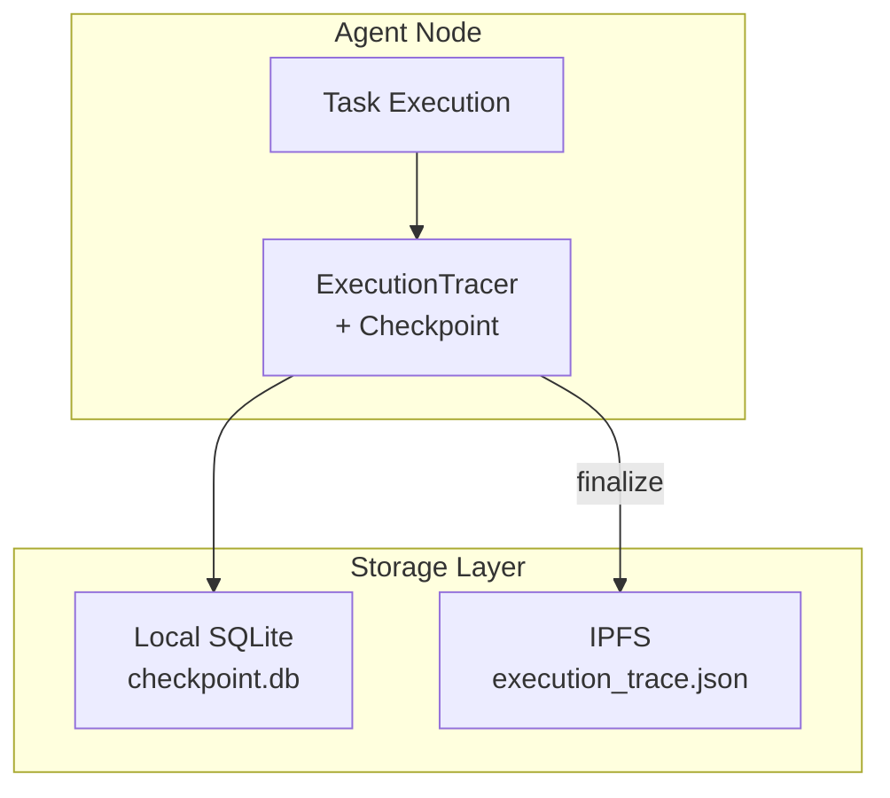
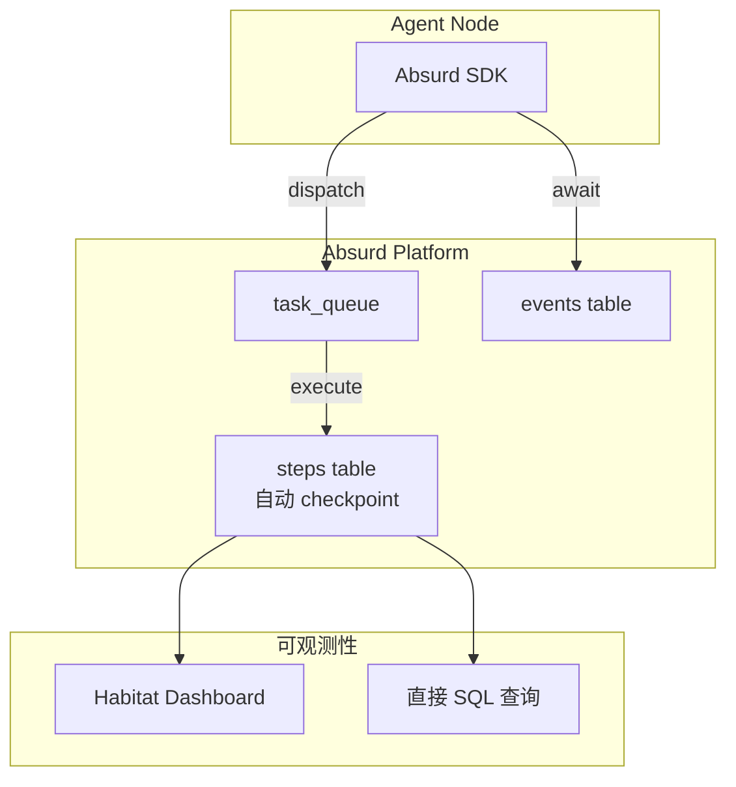
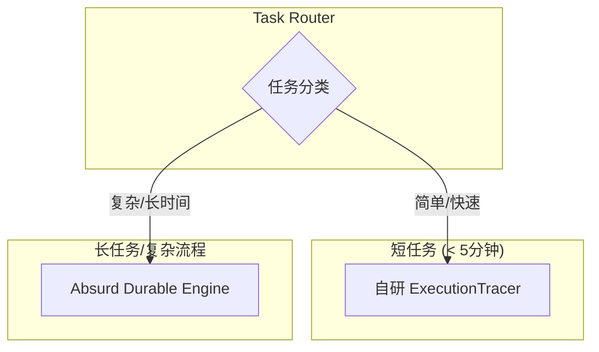

# V2 技术选型：Execution Engine & Observability

> **文档状态**: 草案 (Draft)  
> **创建日期**: 2026-03-28  
> **决策状态**: 待用户确认  
> **影响范围**: Agent Arena V2 架构

---

## 1. 背景与目标

### 1.1 当前 V1 架构问题

| 问题 | 影响 | 严重程度 |
|------|------|----------|
| 执行过程非持久化 | Agent 崩溃后任务状态丢失 | 🔴 高 |
| 手动重试机制 | 需要人工介入恢复 | 🔴 高 |
| 观测数据独立存储 | Trace 和任务状态分离 | 🟡 中 |
| 无内置 Dashboard | 需要自建监控界面 | 🟡 中 |

### 1.2 V2 目标

1. **Durable Execution**: 任务执行可恢复，崩溃后自动重试
2. **统一可观测性**: 执行步骤、状态、日志一体化
3. **简化运维**: 内置监控界面，减少自建工作量
4. **保持去中心化**: 尽可能减少对中心化服务的依赖

---

## 2. 方案对比

### 方案 A: 自研增强 (Enhanced In-House)

基于 V1 的 ExecutionTracer，增加持久化和恢复能力。



**核心设计**:
```typescript
class DurableTracer {
  private db: SQLiteDatabase;
  
  async step<T>(name: string, fn: () => Promise<T>): Promise<T> {
    // 1. 检查 checkpoint
    const saved = await this.db.get(
      'SELECT result FROM checkpoints WHERE task_id = ? AND step_name = ?',
      [this.taskId, name]
    );
    if (saved) return JSON.parse(saved.result);
    
    // 2. 执行
    const result = await fn();
    
    // 3. 保存 checkpoint
    await this.db.run(
      'INSERT INTO checkpoints (task_id, step_name, result) VALUES (?, ?, ?)',
      [this.taskId, name, JSON.stringify(result)]
    );
    
    return result;
  }
  
  async recover(): Promise<void> {
    // 从最后一个 checkpoint 恢复执行
    const lastCheckpoint = await this.db.get(
      'SELECT * FROM checkpoints WHERE task_id = ? ORDER BY created_at DESC LIMIT 1',
      [this.taskId]
    );
    // ... 恢复逻辑
  }
}
```

#### 优点
| 优点 | 说明 |
|------|------|
| 完全控制 | 代码自主，无外部依赖 |
| 去中心化 | SQLite 本地文件，无中心化服务 |
| 零额外成本 | 无需托管 Postgres |
| 渐进升级 | 从 V1 平滑过渡 |

#### 缺点
| 缺点 | 说明 |
|------|------|
| 开发工作量大 | 需要自研 durable execution 全套逻辑 |
| 无 Dashboard | 需要自建监控界面 |
| 测试负担重 | 需要测试各种故障恢复场景 |
| 社区支持少 | 遇到问题需要自己解决 |

**预估工作量**: 2-3 周 (ExecutionTracer 增强 + Dashboard + 测试)

---

### 方案 B: Absurd 集成 (Postgres-Native Durable Execution)

使用 Absurd 作为执行引擎，获得原生的 durable workflow 能力。



**核心设计**:
```typescript
import { Absurd } from 'absurd-sdk';

const app = new Absurd({ databaseUrl: process.env.ABSURD_DB_URL });

app.registerTask({ name: 'arena-task' }, async (task, ctx) => {
  // 每个 step 自动 checkpoint，崩溃后自动恢复
  
  const plan = await ctx.step('analyze', async () => {
    return await analyzeTask(task);
  });
  
  const result = await ctx.step('execute', async () => {
    return await executePlan(plan);
  });
  
  // 等待 Judge 评分
  const evaluation = await ctx.awaitEvent(`judge:${task.id}`);
  
  await ctx.step('finalize', async () => {
    return await submitResult(task, result, evaluation);
  });
  
  return result;
});

// Worker 自动处理重试和恢复
await app.startWorker();
```

#### 优点
| 优点 | 说明 |
|------|------|
| 成熟方案 | 专注 durable execution，经过验证 |
| 开发工作量小 | 几百行代码 vs 几千行 |
| 自带 Dashboard | Habitat 提供任务监控界面 |
| 自动可观测性 | steps 表自动记录执行历史 |
| 社区支持 | 有问题可以找社区 |

#### 缺点
| 缺点 | 说明 |
|------|------|
| 中心化依赖 | 依赖 Postgres，与去中心化理念冲突 |
| 额外成本 | Postgres 托管费用 ($10-50/月) |
| 供应商锁定 | 深度集成后难以迁移 |
| 网络依赖 | 需要稳定连接 Absurd 服务 |
| 学习成本 | 需要理解 Absurd 的抽象模型 |

**预估工作量**: 3-5 天 (集成 + 测试)

---

### 方案 C: 混合架构 (Hybrid)

短任务用自研方案，长任务/复杂流程用 Absurd。



**路由逻辑**:
```typescript
async function routeTask(task: Task) {
  if (task.estimatedDuration < 300000 && task.complexity === 'simple') {
    // 短任务：自研方案
    return await simpleExecute(task);
  } else {
    // 长任务：Absurd
    return await absurd.dispatch('complex-task', task);
  }
}
```

#### 优点
| 优点 | 说明 |
|------|------|
| 灵活 | 根据场景选择最优方案 |
| 成本控制 | 只有复杂任务产生额外成本 |
| 渐进采用 | 可以逐步增加 Absurd 使用比例 |

#### 缺点
| 缺点 | 说明 |
|------|------|
| 维护两套系统 | 增加运维复杂度 |
| 决策开销 | 需要维护分类逻辑 |
| 数据分散 | 观测数据分布在两个系统 |

**预估工作量**: 1-2 周 (路由逻辑 + 两套系统集成)

---

## 3. 详细对比矩阵

| 维度 | 方案 A (自研) | 方案 B (Absurd) | 方案 C (混合) |
|------|--------------|----------------|--------------|
| **开发时间** | 2-3 周 | 3-5 天 | 1-2 周 |
| **运维复杂度** | 中 | 低 | 高 |
| **去中心化程度** | 高 | 低 | 中 |
| **可靠性** | 取决于实现 | 高 | 高 |
| **可观测性** | 需自建 | 内置 | 混合 |
| **成本** | 低 | 中 ($10-50/月) | 中 |
| **供应商锁定** | 无 | 高 | 中 |
| **社区支持** | 无 | 有 | 有 |
| **Dashboard** | 需自建 | 自带 Habitat | 部分 |

---

## 4. 决策建议

### 4.1 场景分析

**选择方案 A (自研) 如果**:
- 去中心化是核心卖点，不能妥协
- 有足够开发资源 (2-3 周)
- 希望完全控制技术栈
- 预算有限，不能承担托管成本

**选择方案 B (Absurd) 如果**:
- 快速交付是首要目标
- 愿意接受中心化 Postgres
- 希望减少运维负担
- 需要内置 Dashboard

**选择方案 C (混合) 如果**:
- 需要在去中心化和效率之间平衡
- 有不同类型任务需要差异化处理
- 愿意承担额外的维护复杂度

### 4.2 推荐决策

> **Hackathon MVP (V1)**: 保持当前自研方案
> - 理由：简单、去中心化、易于演示

> **生产版本 (V2)**: 建议方案 B (Absurd)
> - 理由：开发效率高、自带可观测性、减少运维负担
> - 妥协：接受中心化 Postgres，但执行逻辑仍在 Agent 本地

> **长期演进 (V3)**: 考虑自研方案 A
> - 理由：当业务稳定后，逐步替换为完全去中心化方案

---

## 5. 风险与缓解

### 方案 B (Absurd) 风险

| 风险 | 影响 | 缓解措施 |
|------|------|----------|
| Absurd 停止维护 | 高 | 保持架构抽象，便于迁移 |
| Postgres 托管商锁定 | 中 | 使用标准 Postgres，可迁移 |
| 网络分区导致任务卡住 | 高 | 设计超时机制，支持手动干预 |
| 成本超支 | 中 | 监控使用量，设置告警 |

### 迁移回自研方案的路径

如果未来需要从 Absurd 迁回自研：

```typescript
// 抽象接口
interface ExecutionEngine {
  dispatch(task: Task): Promise<void>;
  step<T>(name: string, fn: () => Promise<T>): Promise<T>;
  awaitEvent(name: string): Promise<any>;
}

// Absurd 实现
class AbsurdEngine implements ExecutionEngine { ... }

// 自研实现
class InHouseEngine implements ExecutionEngine { ... }

// 使用处
const engine: ExecutionEngine = config.USE_ABSURD 
  ? new AbsurdEngine() 
  : new InHouseEngine();
```

---

## 6. 实施建议

### 如果选择方案 B (Absurd)

**Phase 1: 技术验证** (1 周)
- [ ] 部署 Absurd Postgres 实例
- [ ] 实现简单的 task dispatch 和 step 执行
- [ ] 测试崩溃恢复场景
- [ ] 评估 Habitat Dashboard 是否满足需求

**Phase 2: 核心集成** (1 周)
- [ ] 替换现有 AgentLoop 的执行逻辑
- [ ] 集成 Judge 事件等待
- [ ] 迁移现有观测数据格式

**Phase 3: 生产就绪** (1 周)
- [ ] 性能测试
- [ ] 灾难恢复测试
- [ ] 监控告警配置
- [ ] 文档更新

### 如果选择方案 A (自研)

**Phase 1: Checkpoint 系统** (1 周)
- [ ] 设计 SQLite schema
- [ ] 实现 step() 和 recover() 方法
- [ ] 添加自动重试逻辑

**Phase 2: Dashboard** (1 周)
- [ ] 设计监控界面
- [ ] 实现任务状态查询
- [ ] 支持手动重试/取消

**Phase 3: 测试优化** (1 周)
- [ ] 故障注入测试
- [ ] 压力测试
- [ ] 边缘 case 处理

---

## 7. 参考资源

- [Absurd 官方文档](https://earendil-works.github.io/absurd/)
- [Absurd GitHub](https://github.com/earendil-works/absurd)
- [Durable Execution Patterns](https://docs.temporal.io/workflows)
- [我们的可观测性设计文档](./observability-design.md)

---

## 8. 决策记录

| 日期 | 决策者 | 决策 | 理由 |
|------|--------|------|------|
| 2026-03-28 | - | 文档创建 | 待用户确认最终方案 |
| - | - | 待定 | - |

---

*文档版本: v1.0*  
*最后更新: 2026-03-28*
