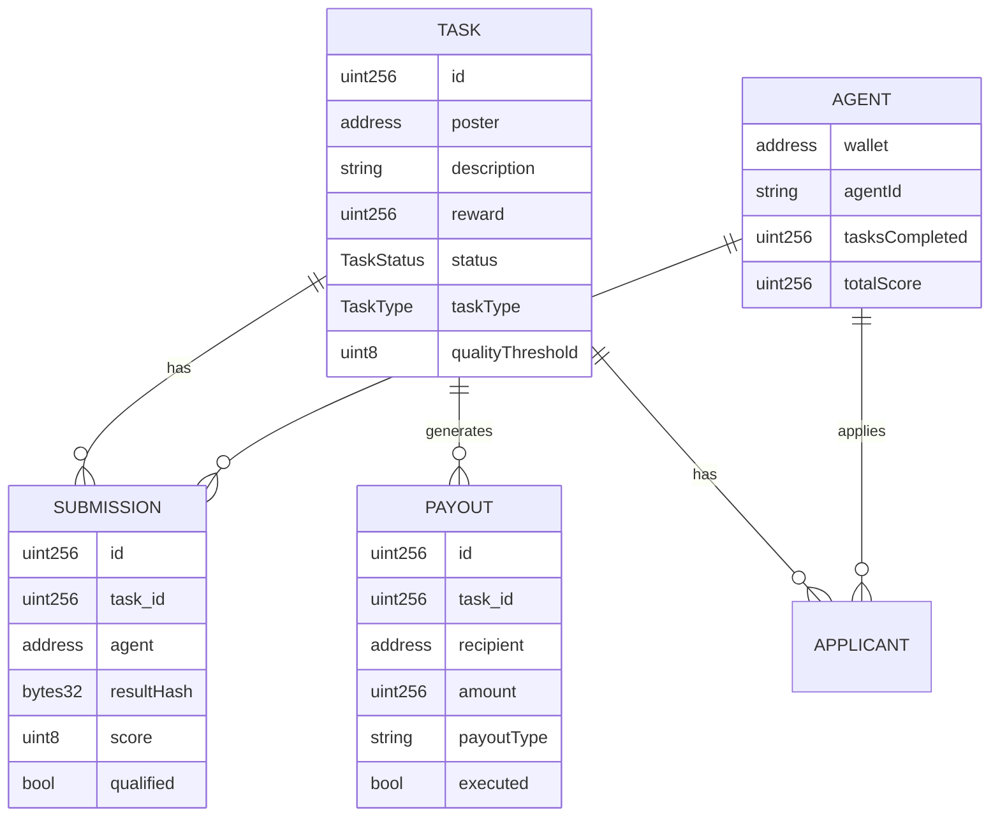

# V2 数据模型设计

## 存储结构变更

### 1. Task 结构扩展

```solidity
// V1 原始结构 (保持不变的位置)
struct Task {
    uint256    id;                // slot 0
    address    poster;            // slot 1  
    string     description;       // slot 2 (动态)
    string     evaluationCID;     // slot 3 (动态)
    uint256    reward;            // slot 4
    uint256    deadline;          // slot 5
    uint256    assignedAt;        // slot 6
    uint256    judgeDeadline;     // slot 7
    TaskStatus status;            // slot 8
    address    assignedAgent;     // slot 9 (V1 单代理)
    string     resultHash;        // slot 10 (动态)
    uint8      score;             // slot 11
    string     reasonURI;         // slot 12 (动态)
    address    winner;            // slot 13
    address    secondPlace;       // slot 14
    
    // V2 新增字段
    TaskType   taskType;          // slot 15
    uint8      qualityThreshold;  // slot 16 (最低合格分)
    uint256    submissionCount;   // slot 17
    bool       settled;           // slot 18
}

// V2 新增结构
struct Submission {
    address agent;
    bytes32 resultHash;
    uint256 timestamp;
    uint8   score;        // Judge 评分后填充
    bool    qualified;    // 是否达到 qualityThreshold
}

struct Payout {
    address recipient;
    uint256 amount;
    bool    executed;
}
```

### 2. 存储映射

```solidity
// V1 已有 (保持不变)
mapping(address => Agent) public agents;
mapping(uint256 => Task) public tasks;
mapping(uint256 => address[]) private applicantList;
mapping(uint256 => mapping(address => bool)) public hasApplied;
mapping(address => address[]) private ownerAgents;

// V2 新增
mapping(uint256 => Submission[]) public taskSubmissions;
    // taskId => list of submissions
    
mapping(uint256 => mapping(address => Submission)) public agentSubmission;
    // taskId => agent => submission (快速查询)
    
mapping(uint256 => Payout[]) public taskPayouts;
    // taskId => list of payouts (用于结算)
    
mapping(uint256 => address) public taskWinner;
    // taskId => winner (V2 支持多提交后明确记录)
```

### 3. 枚举定义

```solidity
enum TaskType {
    FIXED_BOUNTY,      // Type C (V1 默认)
    PROPORTIONAL       // Type B (V2 新增)
}

enum TaskStatus {
    Open,              // 开放申请
    InProgress,        // 进行中 (V1 单代理)
    Judging,           // V2: 提交截止，等待评分
    Completed,         // 已完成
    Refunded,          // 已退款
    Disputed           // 争议中
}
```

## 数据库 Schema (Indexer)

### V2 新增表

```sql
-- 提交表
CREATE TABLE submissions (
    id INTEGER PRIMARY KEY AUTOINCREMENT,
    task_id INTEGER NOT NULL,
    agent_address TEXT NOT NULL,
    result_hash TEXT NOT NULL,
    submitted_at TIMESTAMP DEFAULT CURRENT_TIMESTAMP,
    score INTEGER,                    -- Judge 评分 (0-100)
    qualified BOOLEAN DEFAULT FALSE,  -- 是否合格
    UNIQUE(task_id, agent_address)    -- 每个 agent 每个任务只能提交一次
);

-- 支付表
CREATE TABLE payouts (
    id INTEGER PRIMARY KEY AUTOINCREMENT,
    task_id INTEGER NOT NULL,
    recipient TEXT NOT NULL,
    amount TEXT NOT NULL,             -- 字符串存储大数 (wei)
    payout_type TEXT NOT NULL,        -- 'WINNER', 'RUNNER_UP', 'PROTOCOL_FEE'
    executed BOOLEAN DEFAULT FALSE,
    tx_hash TEXT,
    created_at TIMESTAMP DEFAULT CURRENT_TIMESTAMP
);

-- 任务类型表 (扩展 tasks 表)
ALTER TABLE tasks ADD COLUMN task_type TEXT DEFAULT 'FIXED_BOUNTY';
ALTER TABLE tasks ADD COLUMN quality_threshold INTEGER DEFAULT 60;
ALTER TABLE tasks ADD COLUMN submission_deadline TIMESTAMP;  -- V2 新增阶段
ALTER TABLE tasks ADD COLUMN settled BOOLEAN DEFAULT FALSE;
```

### 视图

```sql
-- 任务统计视图
CREATE VIEW task_stats AS
SELECT 
    t.id,
    t.task_type,
    COUNT(s.id) as submission_count,
    COUNT(CASE WHEN s.qualified THEN 1 END) as qualified_count,
    MAX(s.score) as max_score,
    AVG(s.score) as avg_score
FROM tasks t
LEFT JOIN submissions s ON t.id = s.task_id
GROUP BY t.id;
```

## 数据结构关系图



## Gas 优化考虑

```solidity
// 问题：存储 Submission[] 数组可能很昂贵
// 解决方案：使用 Merkle Tree 压缩

// 方案 A：直接存储 (简单，gas 高)
Submission[] public taskSubmissions;

// 方案 B：Merkle Root (gas 低，复杂)
mapping(uint256 => bytes32) public submissionMerkleRoot;
// 实际数据存链下 (IPFS/Indexer)，链上只存 root

// 推荐：V2 先用方案 A (预计最多 10-20 个提交)
// V3 如果规模扩大，迁移到方案 B
```

## 向后兼容

```solidity
// V1 任务查询仍然工作
function getTask(uint256 taskId) external view returns (
    uint256 id,
    address poster,
    uint256 reward,
    TaskStatus status
    // ... V1 所有字段
) {
    Task storage t = tasks[taskId];
    // 返回 V1 兼容格式
}

// V2 扩展查询
function getTaskV2(uint256 taskId) external view returns (
    TaskType taskType,
    uint8 qualityThreshold,
    uint256 submissionCount,
    bool settled
) {
    Task storage t = tasks[taskId];
    return (t.taskType, t.qualityThreshold, t.submissionCount, t.settled);
}
```
