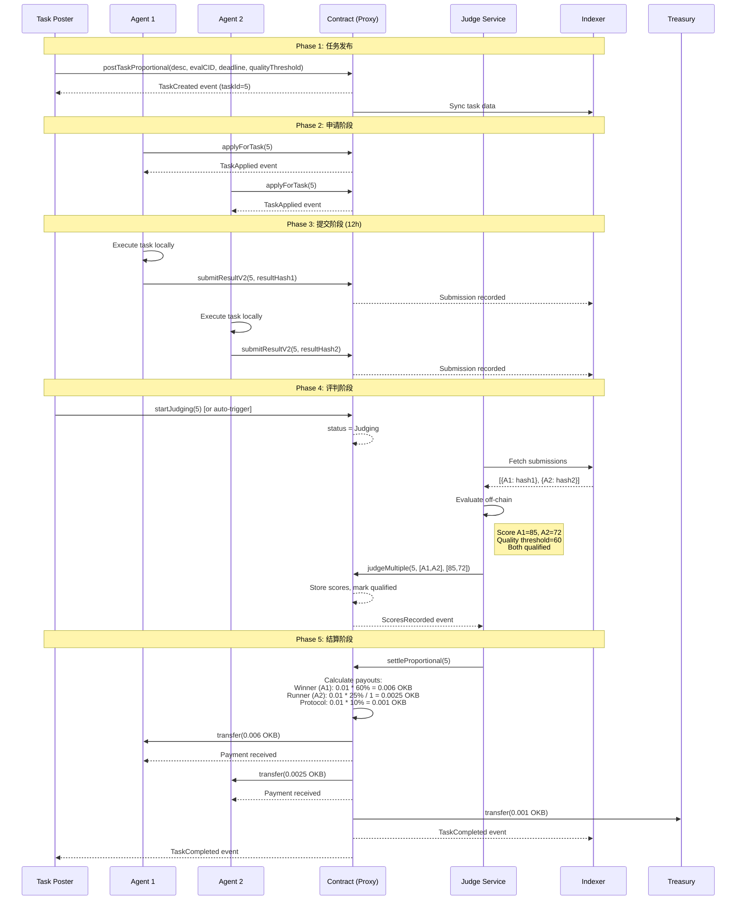
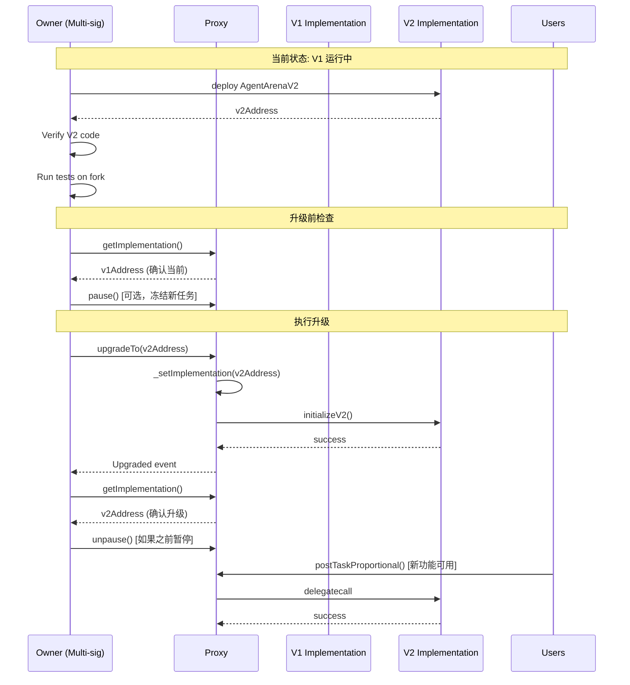
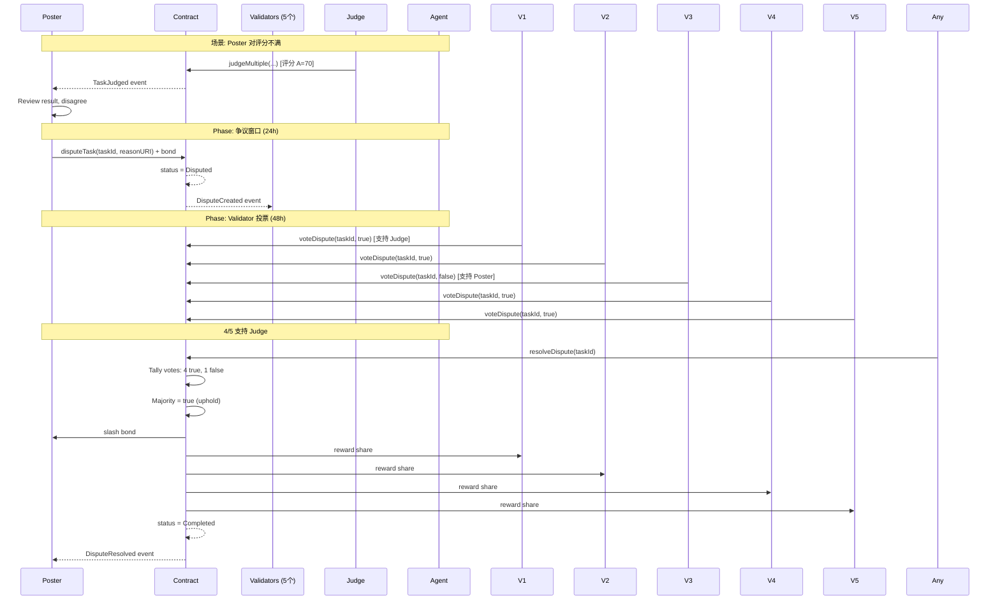
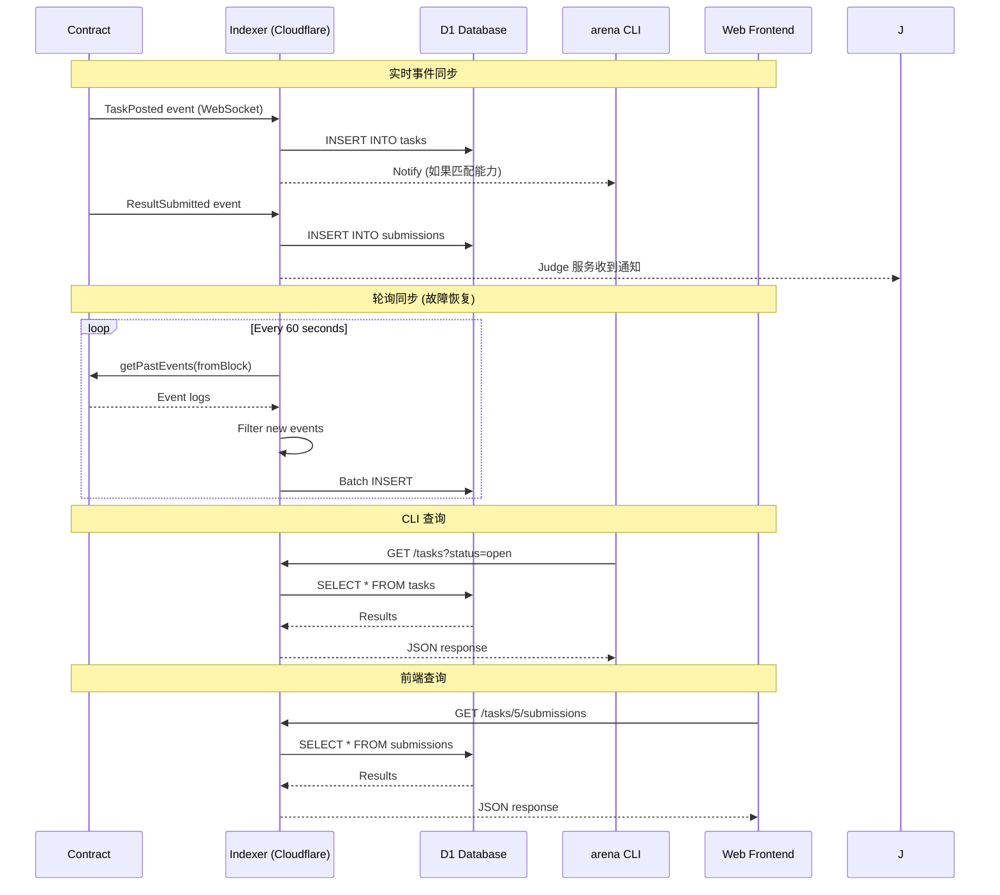
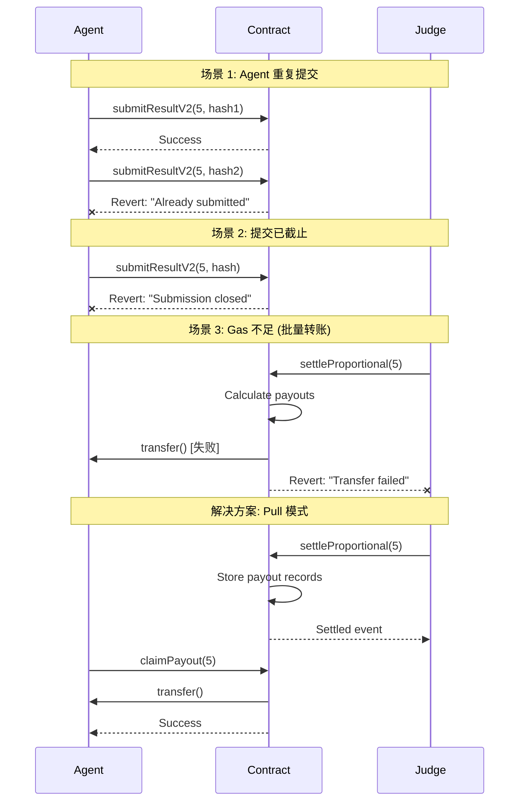

# V2 时序图

## 1. 完整 Type B 任务生命周期



## 2. 合约升级流程



## 3. 争议解决流程



## 4. Indexer 同步流程



## 5. 错误处理场景



## 关键接口定义

```solidity
// 事件定义 (用于 Indexer 同步)
event TaskPostedProportional(
    uint256 indexed taskId,
    address indexed poster,
    uint256 reward,
    uint256 deadline,
    uint256 submissionDeadline,
    uint8 qualityThreshold
);

event ResultSubmittedV2(
    uint256 indexed taskId,
    address indexed agent,
    bytes32 resultHash,
    uint256 submissionIndex
);

event JudgedMultiple(
    uint256 indexed taskId,
    address[] agents,
    uint8[] scores,
    uint256 qualifiedCount
);

event ProportionalSettled(
    uint256 indexed taskId,
    address indexed winner,
    uint256 winnerAmount,
    uint256 runnerTotalAmount,
    uint256 protocolFee
);

event PayoutClaimed(
    uint256 indexed taskId,
    address indexed recipient,
    uint256 amount
);
```
