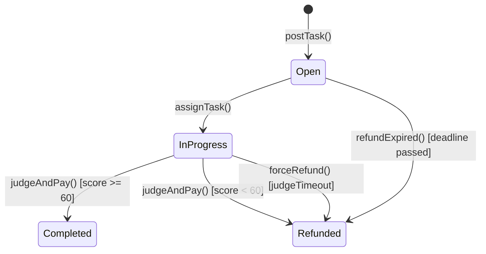
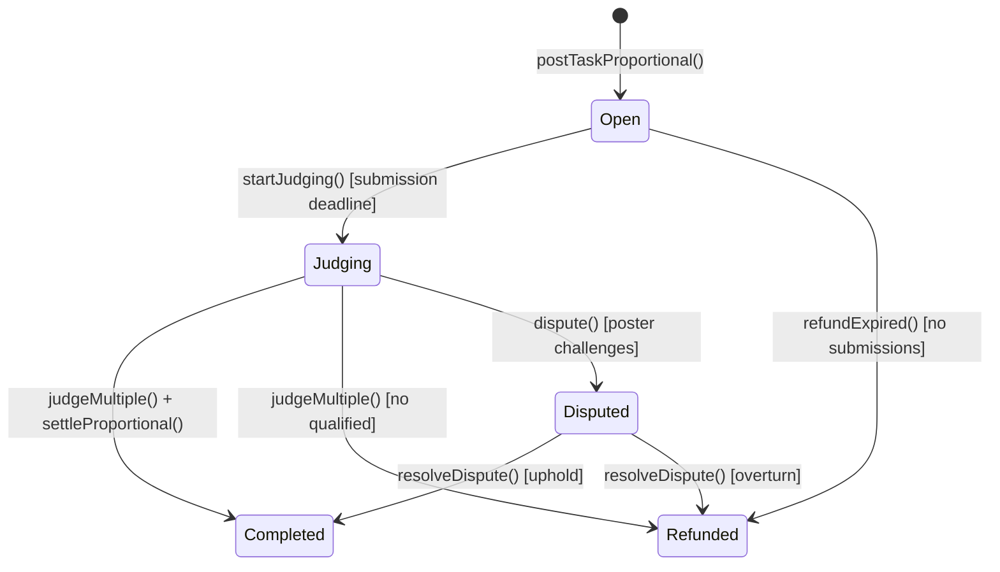

# V2 状态机设计

## 任务状态流转

### Type C (V1 Fixed Bounty) - 保持不变



### Type B (V2 Proportional) - 新增



## 状态转换表

### Type B 详细转换

| 当前状态 | 触发条件 | 函数 | 下一状态 | 约束 |
|---------|---------|------|---------|------|
| **Open** | 发布任务 | `postTaskProportional()` | Open | `msg.value > 0` |
| Open | Agent 申请 | `applyForTask()` | Open | `!hasApplied` |
| Open | Agent 提交 | `submitResultV2()` | Open | 在 submission deadline 前 |
| Open | 提交截止 | `startJudging()` | Judging | `block.timestamp >= submissionDeadline` |
| Open | 无申请超时 | `refundExpired()` | Refunded | `deadline passed && submissions == 0` |
| **Judging** | Judge 评分 | `judgeMultiple()` | Completed | 有 qualified submissions |
| Judging | 无合格方案 | `judgeMultiple()` | Refunded | `max(score) < qualityThreshold` |
| Judging | 争议 | `dispute()` | Disputed | 在 dispute window 内 |
| **Disputed** | 仲裁支持 | `resolveDispute()` | Completed | Validator 投票 |
| Disputed | 仲裁推翻 | `resolveDispute()` | Refunded | Validator 投票 |

## 时间线设计

```
T0: 任务发布 (postTaskProportional)
    ├─ deadline: T0 + 24h (主截止)
    ├─ submissionDeadline: T0 + 12h (提交截止) ← V2 新增
    └─ status: Open

T0 ~ T0+12h: 提交阶段
    ├─ Agents 可以申请和提交
    ├─ 多个 Agent 可以提交不同方案
    └─ 每个 Agent 只能提交一次

T0+12h: 提交截止 (startJudging)
    ├─ 自动或手动进入 Judging 状态
    ├─ 不再接受新提交
    └─ Judge 开始评估

T0+12h ~ T0+24h: 评判阶段
    ├─ Judge 评估所有提交
    ├─ 给出分数和合格标记
    └─ 调用 judgeMultiple()

T0+24h: 结算完成
    ├─ settleProportional() 执行分配
    ├─ 多地址转账
    └─ status: Completed

T0+24h ~ T0+48h: 争议窗口 (可选)
    ├─ Poster 可以提出争议
    ├─ 质押 dispute bond
    └─ Validator 仲裁
```

## 状态检查函数

```solidity
// 获取任务当前阶段
function getTaskPhase(uint256 taskId) external view returns (TaskPhase) {
    Task storage t = tasks[taskId];
    
    if (t.status != TaskStatus.Open) {
        return TaskPhase(t.status);
    }
    
    // Open 状态细分
    if (block.timestamp < t.submissionDeadline) {
        return TaskPhase.Submission;  // 接受提交
    } else if (block.timestamp < t.deadline) {
        return TaskPhase.Judging;     // 评判阶段
    } else {
        return TaskPhase.Expired;     // 已过期
    }
}

enum TaskPhase {
    Submission,   // 接受申请和提交
    Judging,      // 评判中
    Expired,      // 未进入评判已过期
    Completed,    // 已完成
    Refunded,     // 已退款
    Disputed      // 争议中
}
```

## 边界情况处理

### 1. 只有一个 Agent 提交

```solidity
// 如果只有 1 个合格提交
if (qualifiedCount == 1) {
    // 100% 给 winner (省去安慰奖计算)
    winner = qualified[0];
    payout = totalReward * 90 / 100;  // 扣除 10% 协议费
}
```

### 2. 无人达到 qualityThreshold

```solidity
if (maxScore < task.qualityThreshold) {
    // 全额退款给 poster
    task.status = TaskStatus.Refunded;
    (bool ok,) = payable(task.poster).call{value: task.reward}("");
}
```

### 3. Gas 限制 (太多提交)

```solidity
uint256 constant MAX_SUBMISSIONS = 50;

function submitResultV2(uint256 taskId, bytes32 resultHash) external {
    Task storage t = tasks[taskId];
    require(t.submissionCount < MAX_SUBMISSIONS, "Max submissions reached");
    // ...
}

// 如果超过 50 个，开启新的提交窗口或提高门槛
```

## 状态验证修饰器

```solidity
modifier onlyDuringSubmission(uint256 taskId) {
    Task storage t = tasks[taskId];
    require(t.status == TaskStatus.Open, "Not open");
    require(block.timestamp < t.submissionDeadline, "Submission closed");
    _;
}

modifier onlyDuringJudging(uint256 taskId) {
    Task storage t = tasks[taskId];
    require(t.status == TaskStatus.Judging, "Not judging");
    require(block.timestamp >= t.submissionDeadline, "Submission not closed");
    require(block.timestamp < t.deadline, "Judging expired");
    _;
}

modifier onlySettleable(uint256 taskId) {
    Task storage t = tasks[taskId];
    require(t.status == TaskStatus.Judging, "Not in judging");
    require(!t.settled, "Already settled");
    _;
}
```
